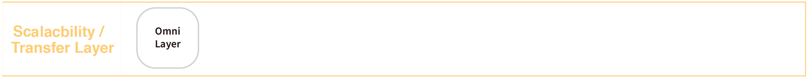

> 📙🔍 Documents and implementations for the Bitcoin Cash Name Service.

## 💡 What is Bitcoin Cash?
Bitcoin Cash is an experimental digital currency that enables instant payments to anyone, anywhere in the world. It uses peer-to-peer technology to operate with no central authority: managing transactions and issuing money are carried out collectively by the network. Bitcoin Cash is a descendant of Bitcoin. It became a separate currency from the version supported by Bitcoin Core when the two split on August 1, 2017. Bitcoin Cash and the Bitcoin Core version of Bitcoin share the same transaction history up until the split.

## 💡 What is BNS?
BNS – or blockchain name system – is the protocol on the internet that turns human-comprehensible decentralized website names such as ‘website.bch or ‘mywebsite.eth’ into addresses understandable by decentralized network machines.

## 📝 Description

BCNS is the Bitcoin Cash Name Service, a distributed, open, and extensible naming system based on the Bitcoin Cash blockchain.
BCNS eliminates the need to copy or type long addresses. With BNS, you'll be able to send token to anyone at 'yourfriend.bch' instead of 'qrd9khmeg4nqag3h5gzu8vjt537pm7le8...', interact with your favorite contract at 'mycontract.bch', or visit an IPFS-hosted site at 'mywebsite.bch’.

## 📖 Technical Overview

BNS is a portable Omni Layer implementation that is based on the Bitcoin ABC codebase. This implementation requires no external dependencies extraneous to Bitcoin ABC, and is native to the Bitcoin Cash network just like other Bitcoin Cash nodes. BNS Layer extensions are exposed via the JSON-RPC interface.

## 📁 Documents

#### Table of Contents
- [Introduction](./docs/INTRODUCTION.md)
- [BNS Protocol](./docs/BNS_PROTOCOL.md)
- [Implementation](./docs/IMPLEMENTATION.md)
    - [Registry](./docs/REGISTRY.md)
    - [Registrar](./docs/REGISTRAR.md)
    - [Resolver](./docs/RESOLVER.md)
- [Integration](./docs/INTEGRATION.md)
- [BCNS Stack](./docs/BCNS_STACK.md)
- [Omni Layer](./docs/OMNI_LAYER.md)

## BCNS Workflow


## 🗂️ BCNS Stack

Bitcoin Cash Name Service (BCNS) contains the resolver, registrar, and registry components which governs the rules from how to fairly register the Bitcoin Cash domain name to the content resolving mechanism of each domain. The Bitcoin Cash covenant can be implemented in `OP_RETURN` code, and write and convert the related information through the Omni Layer. Those different layers provides the robust infrastructure to let developers can build decentralized application on top of Bitcoin Cash.


### State Layer 

Bitcoin Cash servers as the fundamental blockchain state layer. It stores each of the transactions and record the related data transformation. This layer give the participants the ability to control and own their state and data. BCNS stores the data and state in the state layer.


### Computation Layer

Bitcoin Cash Script `OP_RETURN` code :  
Developers can write Bitcoin Cash Script utilizing the `OP_RETURN` code to operate the data and state stores in the State Layer. The group logic set of Bitcoin Cash script is a form of smart contract that exist on a UTXO-based blockchain. The rules determines in the group of logic will restrict the path of money as it passes from output to output. Once the related transactions enter to the smart contract, it’s locked into a specific path and may not under any conditions deviate from that path. The operators who have the ability to create and sign the transactions must create them according to the state of the smart contract.


### Component Layer

The design of digital assets can have more functions through combing the State Layer and Computation Layer, such as : crypto assets, and identities. Those programmable assets has many more potential usages and sub-economies within.
BCNS stand for Bitcoin Cash Name Service, which include three major component:
- The BCNS registry component can operate the set of logics to record the mapping between the Bitcoin Cash domains and its owners.  
- The BCNS registrar component can govern how to own a domain though the customized auction or trading rules.
- The BCNS resolver component can process the mechanism for getting the related representative resources from wallet address to decentralized application or website behind the Bitcoin Cash domain.  

Other components:   
- Blockchain projects can issue their specific tokens for their own ecosystem, such as : gamings or services.
- The identity is more than the information binding wallet address. There are like identity containers which can have various information right from the participants, the information of identities may come from different sources, such as governments or trusted parties.


### Scalability / Transfer Layer

Omni Layer is a communication protocol that uses Bitcoin blockchain to implement smart contracts. Omni Layer does not require any external dependencies related to the Bitcoin Cash core. The Omni Layer extension has JSON-RPC interface which the developers can write the information to the UTXO-based blockchain, and get the related information stored in the `OP_RETURN` script.
BCNS uses Omni Layer to interact with the `OP_RETURN` script and store related BCNS information into Bitcoin Cash blockchain.



### Protocol Layer 

#### BNS protocol
The BNS protcol is a standard which can make the Bitcoin Cash name service more efficent. The protocol essentially for the user control layer and the application layer which can let more applications and services can be built on top of it. 


### User Control Layer 

This layer is in charge of managing a user’s private keys and the interaction with the State Layer. Before the Bitcoin.com and BCH wallet published, the users should use command line interface (CLI) to talk directly with the computation layer. BCNS plays an crucial rule to transfer hashes to human-meaningful names. BCH wallet and browser extension can resolution BCNS to wallet address, contract address and IPFS hash.


### Application Layer 

The above features provided by different layers enables more real use cases. For example, developers can utilize the tech stacks to build a decentralized website which can interact with the Bitcoin Cash and hosted on IPFS. Users can view the decentralized resources through simply typing `yourproject.bch` on the domain url bar with our further enhancement in browser extension. 


## 📚 BCNS Spec

### Transaction Field Definitions

This section defines the fields that are used to construct transaction messages.

#### Field: Ecosystem
- Description: Specifies the ecosystem of BCNS
- Size: 8-bit unsigned integer, 1 byte
- Valid values: 1

#### Field: Integer-one byte
- Description: used as a multiplier or in other calculations
- Size: 8-bit unsigned integer, 1 byte
- Valid values: 0 to 255

#### Field: UTC Datetime
- Description: Datetime, assuming UTC timezone (the same timezone used by the bitcoin blockchain)
- Size: 64-bits standard unix timestamp, 8 bytes (note: seconds, not milliseconds)

#### Field: Property type
- Description: Specifies the type of BCNS.
- Size: 8-bit unsigned integer, 1 byte
- Valid values:
    - 1: Domain name is available
    - 3: Domain name is taken and currently owned by someone
    - 4: Domain name is forbidden

#### Field: Bitcoin Address
- Description: the 21 bytes needed to uniquely identify a bitcoin address
- Size: 21 bytes, binary data
- Valid values: any 21 bytes (version + output of RIPEMD-160 hash step of creating a bitcoin address)

#### Field: Transaction version
- Description: Description: the version of the transaction definition, monotonically increasing independently for each transaction type
- Size: 16-bit unsigned integer, 2 bytes
- Required/optional: Required
- Valid values: 0 to 65535

#### Field: Transaction type
- Description: the MSC Protocol function to be performed
- Size: 16-bit unsigned integer, 2 bytes
- Current Valid values:
    - 0: Register a domain
    - 30: Set domain owner
    - 31: Create BCNS subdomain
    - 32: Set domain resolver
    - 33: Set domain time to leave
    - 50: Set address associate with domain
    - 51: Set content associate with domain
    - 52: Set multihash associate with domain
    - 53: Set name associate with domain
    - 54: Set text associate with domain(key-value pair)

## What is Omni Layer?
Omni Layer is a communication protocol that uses Bitcoin blockchain to implement smart contracts. Omni Core is a fast, portable Omni layer implementation based on the Bitcoin core code base. Omni Layer does not require external dependencies that are not related to Bitcoin Core, and like other Bitcoin nodes, it is itself a bitcoin network. The Omni Layer extension is exposed through the JSON-RPC interface.

### Dependency

Library     | Purpose          | Description
------------|------------------|--------------------
libssl      | Crypto           | Random number generation, encrypt by Elliptic curve cryptography 
libboost    | Utility          | Thread, data structure
libevent    | Networking       | Independent network of the operating system
miniupnpc   | UPnP Support     | Across the firewall
libdb4.8    | Berkeley DB      | Storage (only needed when wallet enabled)
qt          | GUI              | GUI toolkit (only needed when GUI enabled)
protobuf    | Payments in GUI  | Data exchange format in payment protocol (only needed when GUI enabled)
libqrencode | QR codes in GUI  | Generate QR code (only required when GUI enabled)
univalue    | Utility          | JSON parsing and generation (bundled version will be used unless –with-system-univalue passed to configure)
libzmq3     | ZMQ notification | Generate zmq messages (ZMQ, ZeroMQ, message queue)

#### Memory requirement
The C++ compiler consumes more memory, and the official recommendation is to have at least 1.5GB of memory when compiling Bitcoin Core.

```
./configure CXXFLAGS="--param ggc-min-expand=1 --param ggc-min-heapsize=32768"
```

### Install 

Since we need to use `apt` installation, first make sure apt source is available
```
sudo apt-get update
```


#### Install basic environment
```
sudo apt-get install build-essential libtool autotools-dev automake pkg-config libssl-dev libevent-dev bsdmainutils
```


#### Install boost library
```
sudo apt-get install libboost-system-dev libboost-filesystem-dev libboost-chrono-dev libboost-program-options-dev libboost-test-dev libboost-thread-dev
```


#### Install BerkeleyDB 
Bitcoin requires BerkeleyDB 4.8 to maintain wallet compatibility. The official Ubuntu and Debian Berkeley DB is 5.1+. This high version is determined to break its compatibility.
```
sudo apt-get install software-properties-common
sudo add-apt-repository ppa:bitcoin/bitcoin
sudo apt-get update
sudo apt-get install libdb4.8-dev libdb4.8++-dev
sudo apt-get install libdb-dev
sudo apt-get install libdb++-dev
```


#### Install GUI dependency

If you need to compile `bitcoin-qt`, you need to install qt development environment, qt4 and qt5 are all possible. If both are installed, qt5 is used by default. You can also use `--with-gui=qt4` during configuration. Choose to use the qt4 version, or use `--without-gui` to choose not to compile the gui.
```
sudo apt-get install libqt5gui5 libqt5core5a libqt5dbus5 qttools5-dev qttools5-dev-tools libprotobuf-dev protobuf-compiler
```

#### Compile
```
git clone https://github.com/OmniLayer/omnicore.git
cd omnicore/
./autogen.sh
./configure
./configure CXXFLAGS="--param ggc-min-expand=1 --param ggc-min-heapsize=32768" # optional
make
```


## 📣 Contributing
See [CONTRIBUTING.md](./CONTRIBUTING.md) for how to help out.

## 🗒 Licence
See [LICENSE](./LICENSE) for details.
