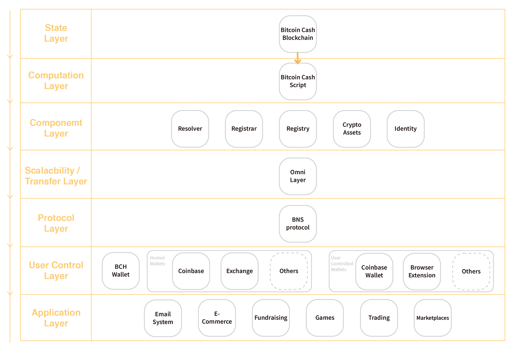
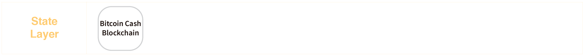
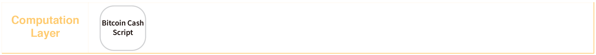
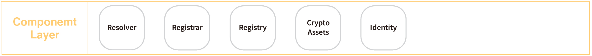
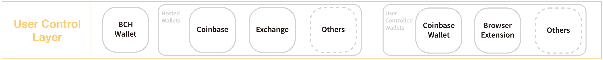
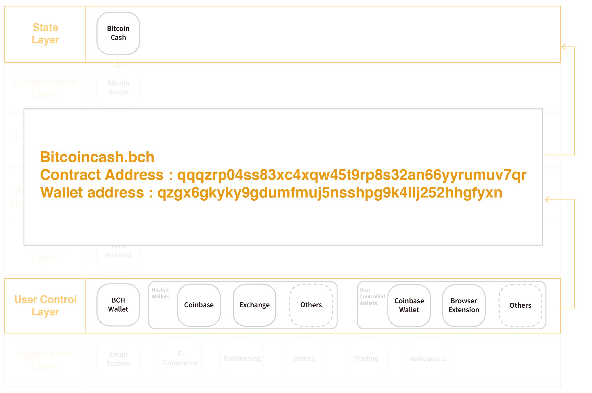

# Bitcoin Cash Name Service (BCNS) Stack

Bitcoin Cash name service (BCNS) contains the resolver, registrar, and registry components which governs the rules from how to fairly register the Bitcoin Cash domain name to the content resolving mechanism of each domain. The Bitcoin Cash covenant can be implemented in `OP_RETURN` code, and write and convert the related information through the Omni Layer. Those different layers provides the robust infrastructure to let developers can build decentralized application on top of Bitcoin Cash.

## State Layer 

Bitcoin Cash servers as the fundamental blockchain state layer. It stores each of the transactions and record the related data transformation. This layer give the participants the ability to control and own their state and data. BCNS stores the data and state in the state layer.

## Computation Layer

Bitcoin Cash Script `OP_RETURN` code :  
Developers can write Bitcoin Cash Script utilizing the `OP_RETURN` code to operate the data and state stores in the State Layer. The group logic set of Bitcoin Cash script is a form of smart contract that exist on a UTXO-based blockchain. The rules determines in the group of logic will restrict the path of money as it passes from output to output. Once the related transactions enter to the smart contract, it’s locked into a specific path and may not under any conditions deviate from that path. The operators who have the ability to create and sign the transactions must create them according to the state of the smart contract.

## Component Layer

The design of digital assets can have more functions through combing the State Layer and Computation Layer, such as : crypto assets, and identities. Those programmable assets has many more potential usages and sub-economies within.
BCNS stand for Bitcoin Cash Name Service, which include three major component:
- The BCNS registry component can operate the set of logics to record the mapping between the Bitcoin Cash domains and its owners.  
- The BCNS registrar component can govern how to own a domain though the customized auction or trading rules.
- The BCNS resolver component can process the mechanism for getting the related representative resources from wallet address to decentralized application or website behind the Bitcoin Cash domain.  

Other components:   
- Blockchain projects can issue their specific tokens for their own ecosystem, such as : gamings or services.
- The identity is more than the information binding wallet address. There are like identity containers which can have various information right from the participants, the information of identities may come from different sources, such as governments or trusted parties.

## Scalability / Transfer Layer

Omni Layer is a communication protocol that uses Bitcoin blockchain to implement smart contracts. Omni Layer does not require any external dependencies related to the Bitcoin Cash core. The Omni Layer extension has JSON-RPC interface which the developers can write the information to the UTXO-based blockchain, and get the related information stored in the `OP_RETURN` script.
BCNS uses Omni Layer to interact with the `OP_RETURN` script and store related BCNS information into Bitcoin Cash blockchain.

## Protocol Layer 

### BNS protocol
The BNS protcol is a standard which can make the Bitcoin Cash name service more efficent. The protocol essentially for the user control layer and the application layer which can let more applications and services can be built on top of it. 

## User Control Layer 

This layer is in charge of managing a user’s private keys and the interaction with the State Layer. Before the Bitcoin.com and BCH wallet published, the users should use command line interface (CLI) to talk directly with the computation layer. BCNS plays an crucial rule to transfer hashes to human-meaningful names. BCH wallet and browser extension can resolution BCNS to wallet address, contract address and IPFS hash.

## Application Layer 

The above features provided by different layers enables more real use cases. For example, developers can utilize the tech stacks to build a decentralized website which can interact with the Bitcoin Cash and hosted on IPFS. Users can view the decentralized resources through simply typing `yourproject.bch` on the domain url bar with our further enhancement in browser extension. 

