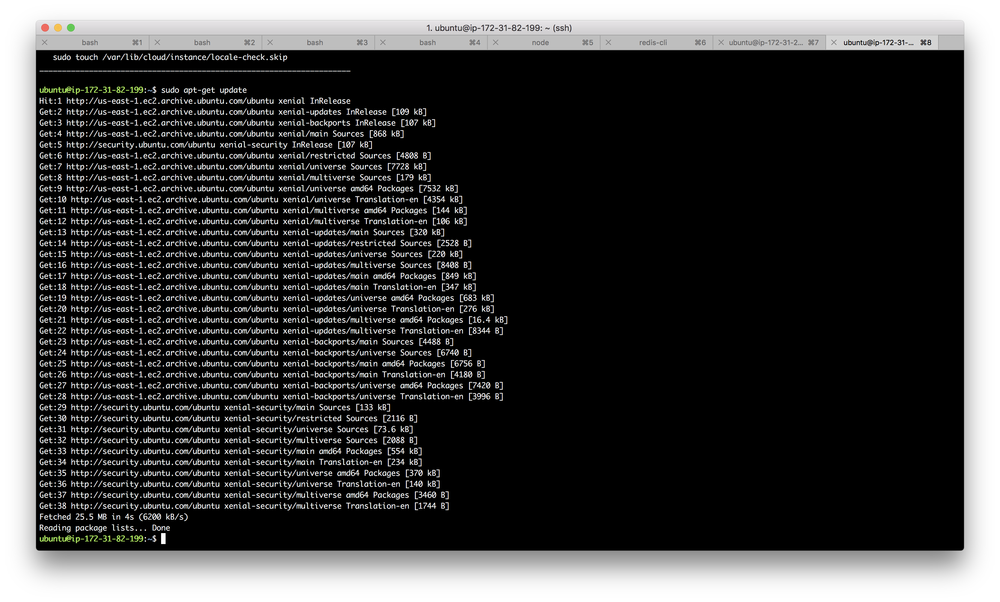
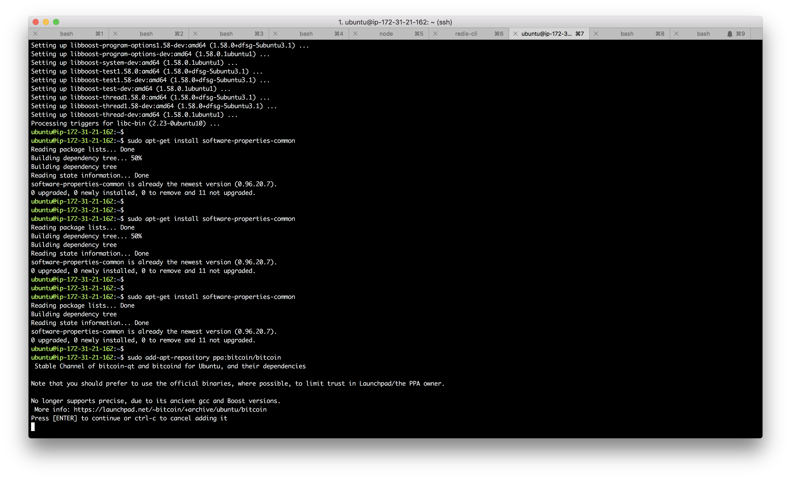
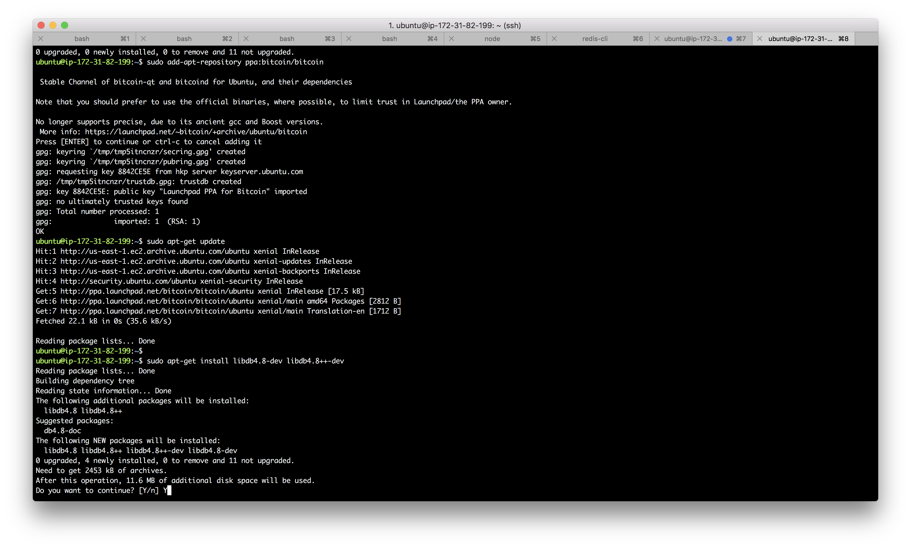
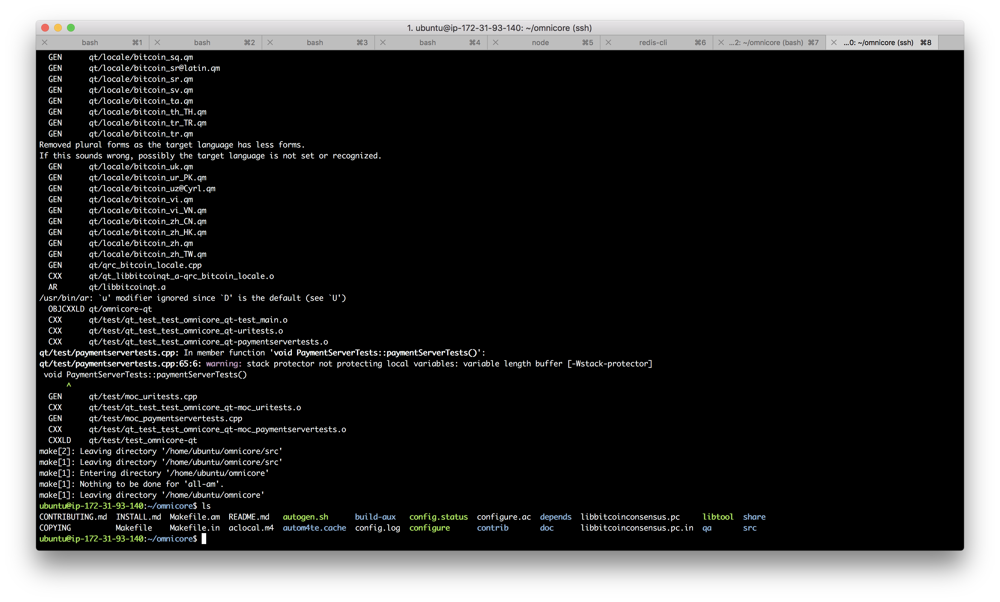

# Omni Layer

## What is Omni Layer?
Omni Layer is a communication protocol that uses Bitcoin blockchain to implement smart contracts. Omni Core is a fast, portable Omni layer implementation based on the Bitcoin core code base. Omni Layer does not require external dependencies that are not related to Bitcoin Core, and like other Bitcoin nodes, it is itself a bitcoin network. The Omni Layer extension is exposed through the JSON-RPC interface.

## Dependency

Library     | Purpose          | Description
------------|------------------|--------------------
libssl      | Crypto           | Random number generation, encrypt by Elliptic curve cryptography 
libboost    | Utility          | Thread, data structure
libevent    | Networking       | Independent network of the operating system
miniupnpc   | UPnP Support     | Across the firewall
libdb4.8    | Berkeley DB      | Storage (only needed when wallet enabled)
qt          | GUI              | GUI toolkit (only needed when GUI enabled)
protobuf    | Payments in GUI  | Data exchange format in payment protocol (only needed when GUI enabled)
libqrencode | QR codes in GUI  | Generate QR code (only required when GUI enabled)
univalue    | Utility          | JSON parsing and generation (bundled version will be used unless –with-system-univalue passed to configure)
libzmq3     | ZMQ notification | Generate zmq messages (ZMQ, ZeroMQ, message queue)

### Memory requirement
The C++ compiler consumes more memory, and the official recommendation is to have at least 1.5GB of memory when compiling Bitcoin Core.

```
./configure CXXFLAGS="--param ggc-min-expand=1 --param ggc-min-heapsize=32768"
```

## Install 

Since we need to use `apt` installation, first make sure apt source is available
```
sudo apt-get update
```


### Install basic environment
```
sudo apt-get install build-essential libtool autotools-dev automake pkg-config libssl-dev libevent-dev bsdmainutils
```


### Install boost library
```
sudo apt-get install libboost-system-dev libboost-filesystem-dev libboost-chrono-dev libboost-program-options-dev libboost-test-dev libboost-thread-dev
```


### Install BerkeleyDB 
Bitcoin requires BerkeleyDB 4.8 to maintain wallet compatibility. The official Ubuntu and Debian Berkeley DB is 5.1+. This high version is determined to break its compatibility.
```
sudo apt-get install software-properties-common
sudo add-apt-repository ppa:bitcoin/bitcoin
sudo apt-get update
sudo apt-get install libdb4.8-dev libdb4.8++-dev
```


### Install GUI dependency

If you need to compile `bitcoin-qt`, you need to install qt development environment, qt4 and qt5 are all possible. If both are installed, qt5 is used by default. You can also use `--with-gui=qt4` during configuration. Choose to use the qt4 version, or use `--without-gui` to choose not to compile the gui.
```
sudo apt-get install libqt5gui5 libqt5core5a libqt5dbus5 qttools5-dev qttools5-dev-tools libprotobuf-dev protobuf-compiler
```

### Compile
```
git clone https://github.com/OmniLayer/omnicore.git
cd omnicore/
./autogen.sh
./configure
./configure CXXFLAGS="--param ggc-min-expand=1 --param ggc-min-heapsize=32768" # optional
make
```

